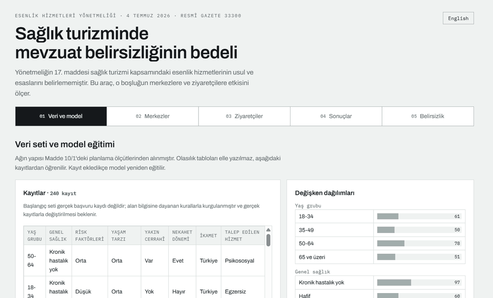
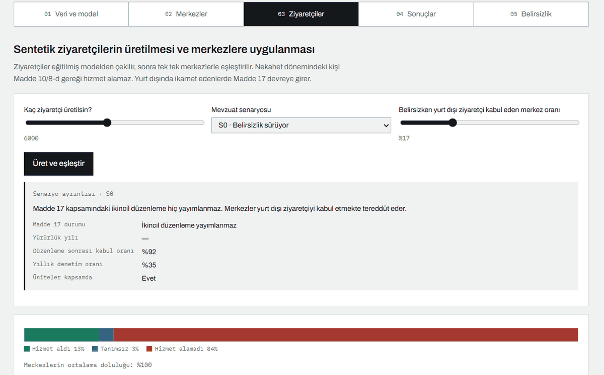
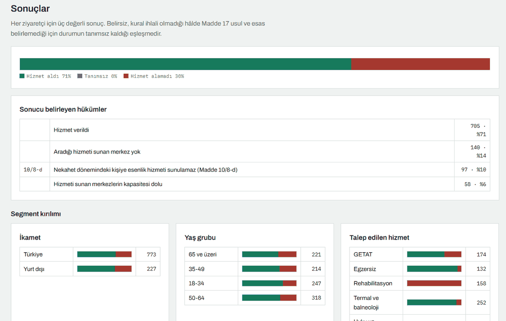
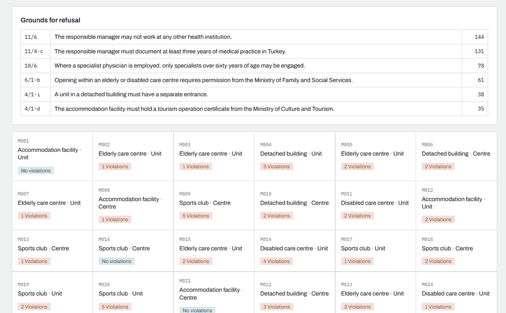

# TR-Wellness-Regulation-Sim

Esenlik Hizmetleri Yönetmeliği ve sağlık turizmi üzerine bir düzenleyici etki analizi aracı. Mevzuat belirsizliğini ölçülebilir kılar.

[](LICENSE)


*A regulatory impact analysis tool for Turkey's Wellness Services Regulation and health tourism, making regulatory uncertainty measurable. English documentation follows the Turkish text.*



## Hızlı başlangıç

`index.html` dosyasını indirip herhangi bir tarayıcıda açın. Kurulum, sunucu ya
da internet bağlantısı gerekmez; bütün kaynaklar dosyanın içine gömülüdür.

```bash
git clone https://github.com/gamze-kose/TR-Wellness-Regulation-Sim.git
cd TR-Wellness-Regulation-Sim
# index.html dosyasını çift tıklayın
```

---

## Ne işe yarar

Yeni yayımlanan bir yönetmeliğin hükümleri her zaman tek başına uygulanabilir değildir. Kimi hüküm ikincil düzenlemeye bırakılır, kimi kavram tanımsız kalır, kimi takdir yetkisi ölçüt verilmeden tanınır. Bu belirsizlikler hukuk metinlerinde tartışılır ancak ölçülmez.

TR-Wellness-Regulation-Sim bu boşluğu ölçülebilir kılar. Yönetmelik metnini makine tarafından okunabilir kurallara çevirir, sentetik esenlik merkezleri ve sağlık turistleri üretir, bunları kurallar karşısında eşleştirir ve **üç değerli** bir sonuç verir: uygun, uygun değil ya da **belirsiz**.

Üçüncü durum aracın çekirdeğidir. Esenlik Hizmetleri Yönetmeliği'nin (4 Temmuz 2026, RG 33300) 17 nci maddesi sağlık turizmi kapsamındaki hizmetlerin usul ve esaslarını Sağlık Bakanlığına bırakmış, ikincil düzenleme yayımlanmamış, denetim aracı olan EK-4'te ise konuya ilişkin tek bir soru yer almamıştır. Bir merkez, yurt dışında ikamet eden ziyaretçiye hizmet verirken kurala uygun mu aykırı mı davrandığını bilememektedir. Bu eşleşmeler ne uygun ne uygun değildir; tanımsızdır.

## Nasıl kullanılır

`index.html` dosyasını herhangi bir tarayıcıda açın. Kurulum, sunucu ya da internet bağlantısı gerekmez; bütün kaynaklar dosyanın içine gömülüdür. Arayüz Türkçe ve İngilizcedir, sağ üstteki düğmeyle değiştirilir.

Araç beş adımda ilerler:

**01 · Veri ve model.** Ziyaretçi modelinin öğrendiği kayıt seti. Kayıtlar görülür, eklenir, silinir; her değişiklikte model yeniden eğitilir. Öğrenilen olasılık tabloları, her satırın kaç gözleme dayandığıyla birlikte incelenir. Modelden tek tek profil çekilebilir.


Ağ topolojik sırayla dolaşılarak profil üretilir; her düğümde hangi olasılık
satırından çekim yapıldığı ve o satırın kaç gözleme dayandığı görülür.


**02 · Merkezler.** Başvurular önce yapısal kurallardan geçirilir; metrekare, oda sayısı, kurum izni ve mesul müdür şartlarını sağlamayan başvuru ruhsat alamaz. Ruhsat alanlar EK-4 denetim kurallarına göre değerlendirilir.


Uyum maliyeti katmanı hangi merkez türünün ayakta kalabildiğini gösterir.



**03 · Ziyaretçiler.** Sentetik sağlık turistleri eğitilmiş modelden çekilir ve tek tek merkezlerle eşleştirilir. Nekahet dönemindeki kişi Madde 10/8-d gereği hizmet alamaz; yurt dışında ikamet edenlerde Madde 17 devreye girer.



**04 · Sonuçlar.** Sonucu belirleyen hükümler ve segment kırılımları.


Duyarlılık analizi, hangi çıktının hangi parametreye ne ölçüde bağlı olduğunu
gösterir. Serbest parametrelerin etkisini görünür kılmak, gizlemekten daha
dürüsttür.


Beş senaryonun on yıllık seyri; koyu çizgi ortanca, açık alan tekrarların
yüzde 10–90 aralığıdır.


**05 · Belirsizlik.** Yönetmelik metninin madde madde taranmasıyla çıkarılan belirsizlik kataloğu. On dört kayıt altı türe ayrılmıştır; Madde 17 bunlardan yalnızca biridir.


## Yöntem

**Ziyaretçi modeli.** Ağın yapısı uzman tarafından belirlenir: hangi değişkenler var, hangisi hangisine bağlı. Değişkenler Madde 10/1'deki kişiye özgü planlama ölçütlerinden alınmıştır — yaş, genel sağlık durumu, mevcut risk faktörleri ve yaşam tarzı. Buna Madde 10/8-d gereği nekahet durumu ve Madde 17 gereği ikamet eklenmiştir. Olasılık tabloları elle yazılmaz, kayıt setinden öğrenilir. Sayımlara düzgün dağılımlı küçük bir Dirichlet öncülü eklenir; tek amacı hiç gözlem düşmemiş satırı tanımsız bırakmamaktır ve kayıt sayısı arttıkça etkisi kaybolur.

**Kural motoru.** EK-4 denetim formundaki 21 soru ile yönetmelik maddelerinden türetilen 12 yapısal kural uygulanır. İki küme farklı anlarda işler: yapısal kurallar ruhsat aşamasında, EK-4 kuralları işletme sırasında.

**Yaptırım merdiveni.** EK-4 her kural için birinci, ikinci ve üçüncü tespitte ayrı yaptırım tanımlar. Merkezler tek tek izlenir ve her birinin kendi tespit sayaçları tutulur; merdiven ancak böyle işleyebilir, ortalamaya indirgenirse anlamını yitirir.

**Düzenleyici etki katmanları.** Uyum maliyetleri, ruhsat alamayan işletmelerin kayıt dışı faaliyet dalı, sınırlı denetim kapasitesi ve her parametre için duyarlılık analizi.

## Uyarılar

**Bu bir öngörü değildir.** Bir aylık bir sektörün on yıllık seyrini kestirecek veri yoktur. Giriş oranı, talep büyümesi, uyum davranışı ve maliyet tutarları varsayımdır. Sonuçlar tek bir kestirim yerine tekrarların ortancası ve yüzde 10–90 aralığı olarak raporlanır. Anlamlı olan mutlak sayılar değil, senaryolar arasındaki farklar ve duyarlılık sıralamasıdır.

**Veri sentetiktir.** Tüm merkezler ve ziyaretçiler üretilmiştir. Gerçek kişi ya da kuruluş verisi kullanılmaz. `veri/ornek_kayitlar.json` gerçek başvuru kaydı değil, alan bilgisine dayanan kurallarla kurgulanmış bir başlangıç setidir ve gerçek kayıtlarla değiştirilmesi beklenir.

**Bağlayıcı metin Resmî Gazete'dir.** Kural setleri yönetmelikten aktarılmıştır; hukuki bir yorum ya da danışmanlık değildir.

## Dosyalar

```
index.html                          Tek dosyalık arayüz, doğrudan açılır
sablon.html                         Arayüz kaynağı
paketle.py                          index.html dosyasını yeniden üretir

mevzuat/ek4_denetim.json            EK-4 denetim formunun 21 kuralı
mevzuat/yapisal_kurallar.json       Madde metinlerinden türetilen 12 kural
mevzuat/belirsizlik_haritasi.json   14 kayıtlık belirsizlik kataloğu
mevzuat/uyum_maliyeti.json          8 kalemlik uyum maliyeti
mevzuat/hizmetler.json              Madde 4/1-c'deki 24 hizmet
mevzuat/ag_yapisi.json              Ziyaretçi ağının yapısı
mevzuat/senaryolar.json             Beş mevzuat senaryosu

gorseller/                          README ekran görüntüleri

veri/ornek_kayitlar.json            Başlangıç kayıt seti
veri/uret_ornek.py                  Başlangıç setini üreten betik

web/model.js                        Bayes ağı ve veriden öğrenme
web/akis.js                         Merkez üretimi, kural denetimi, eşleştirme
web/analiz.js                       Uyum maliyeti ve duyarlılık analizi

cekirdek/                           Çok yıllı simülasyon (Python)
onhesap.py                          Projeksiyonları önceden hesaplar
calistir.py                         Beş senaryoyu komut satırında koşturur
```

## Geliştirme

```bash
python3 veri/uret_ornek.py   # başlangıç kayıt setini yeniden üretir
python3 calistir.py          # beş senaryoyu komut satırında koşturur
python3 onhesap.py           # projeksiyonları hesaplar
python3 paketle.py           # index.html dosyasını yeniden üretir
```

Çekirdek yalnızca standart kütüphaneye bağlıdır; kurulum gerekmez.

## İlgili bildiri

Bu araç aşağıdaki bildiri kapsamında geliştirilmiştir:

> Köse, G. & Köse, U. (2026). Measuring Uncertainty: An Artificial Intelligence
> Assisted Regulatory Impact Analysis of the Wellness Services Regulation and
> Health Tourism. *INNOVAHEALTH 2026 — 3rd International Congress on Innovative
> Approaches in Health Sciences*, 2–5 Eylül 2026, Girne, KKTC.

## Lisans

MIT

---

# TR-Wellness-Regulation-Sim (English)

A regulatory impact analysis tool for Turkey's Wellness Services Regulation and health tourism, making regulatory uncertainty measurable.

## What it does

The provisions of a newly published regulation are not always applicable on their own. Some are deferred to secondary regulation, some concepts are left undefined, some discretion is granted without criteria. Such uncertainties are debated in legal texts but not measured.

TR-Wellness-Regulation-Sim makes that gap measurable. It converts the regulation into machine-readable rules, generates synthetic wellness centres and health tourists, matches them against the rules and returns a **three-valued** outcome: compliant, non-compliant or **undefined**.

The third state is the core of the tool. Article 17 of the Wellness Services Regulation (4 July 2026, Official Gazette 33300) defers the procedures for wellness services within health tourism to the Ministry of Health, that secondary regulation has not been issued, and Annex 4, the inspection instrument, contains no question on it. A centre cannot know whether serving a visitor resident abroad complies with the rules. Such matches are neither compliant nor non-compliant; they are undefined.

## Usage

Open `index.html` in any browser. No installation, server or internet connection is required; all resources are embedded in the file. The interface is available in Turkish and English via the button at the top right.

The tool proceeds in five steps:

**01 · Data and model.** The record set the visitor model learns from. Records can be viewed, added and deleted; every change retrains the model. The learned probability tables are shown together with the number of observations each row rests on. Individual profiles can be drawn from the model.

**02 · Centres.** Applications first pass the structural rules; those failing area, room, permit or responsible-manager conditions receive no licence. Licensed centres are assessed against the Annex 4 inspection rules. A compliance cost layer shows which centre types remain viable.

**03 · Visitors.** Synthetic health tourists are drawn from the trained model and matched against the centres one by one. A person in convalescence is ineligible under Article 10(8)(d); for those resident abroad, Article 17 comes into play.

**04 · Results.** The provisions determining the outcome, segment breakdowns, a sensitivity analysis and a ten-year projection of five scenarios.

**05 · Uncertainty.** A catalogue produced by reading the regulation article by article. Fourteen entries across six types; Article 17 is only one of them.

The interface is fully bilingual; every label, rule text and service name is
available in both languages.



## Method

**Visitor model.** The structure of the network is set by domain expertise: which variables exist and which depends on which. The variables come from the individual planning criteria of Article 10(1) — age, general health status, existing risk factors and lifestyle — extended with convalescence under Article 10(8)(d) and residence under Article 17. The probability tables are not written by hand but learned from the record set. A small uniform Dirichlet prior is added to the counts, solely so that rows with no observations are not left undefined; its influence vanishes as records accumulate.

**Rule engine.** Twenty-one inspection questions from Annex 4 and twelve structural rules derived from the articles. The two sets act at different moments: structural rules at licensing, Annex 4 rules during operation.

**Sanction ladder.** Annex 4 defines a distinct sanction for the first, second and third detection of each rule. Centres are tracked individually with their own detection counters; the ladder can only operate this way and loses its meaning if reduced to an average.

**Regulatory impact layers.** Compliance costs, an unlicensed operation branch for refused applications, limited inspection capacity, and a sensitivity analysis over every parameter.

## Caveats

**This is not a forecast.** There is no data to project a sector one month old across ten years. Entry rate, demand growth, compliance behaviour and cost figures are assumptions. Results are reported as the median and the 10–90 percentile range across repetitions rather than as a single estimate. What matters is not the absolute numbers but the differences between scenarios and the ranking of sensitivities.

**The data is synthetic.** All centres and visitors are generated. No real person or institution data is used. `veri/ornek_kayitlar.json` is not real intake data but a starter set constructed from domain rules, expected to be replaced with real records.

**The binding text is the Official Gazette.** The rule sets are transcriptions of the regulation and constitute neither legal interpretation nor advice.

## Development

```bash
python3 veri/uret_ornek.py   # regenerate the starter record set
python3 calistir.py          # run the five scenarios on the command line
python3 onhesap.py           # compute the projections
python3 paketle.py           # rebuild index.html
```

The core depends only on the standard library; no installation is needed.

## Related paper

This tool was developed as part of the following paper:

> Köse, G. & Köse, U. (2026). Measuring Uncertainty: An Artificial Intelligence
> Assisted Regulatory Impact Analysis of the Wellness Services Regulation and
> Health Tourism. *INNOVAHEALTH 2026 — 3rd International Congress on Innovative
> Approaches in Health Sciences*, 2–5 September 2026, Kyrenia, TRNC.

## License

MIT
