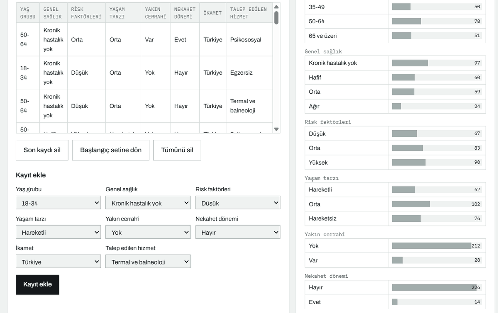
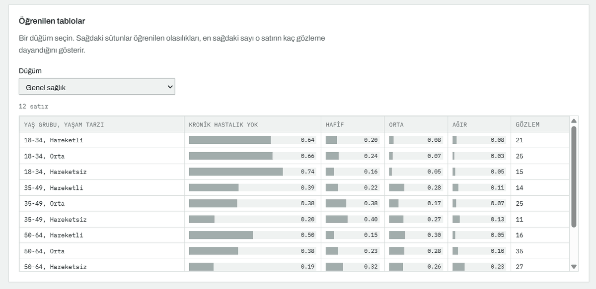
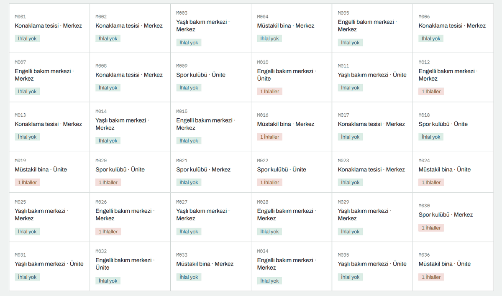
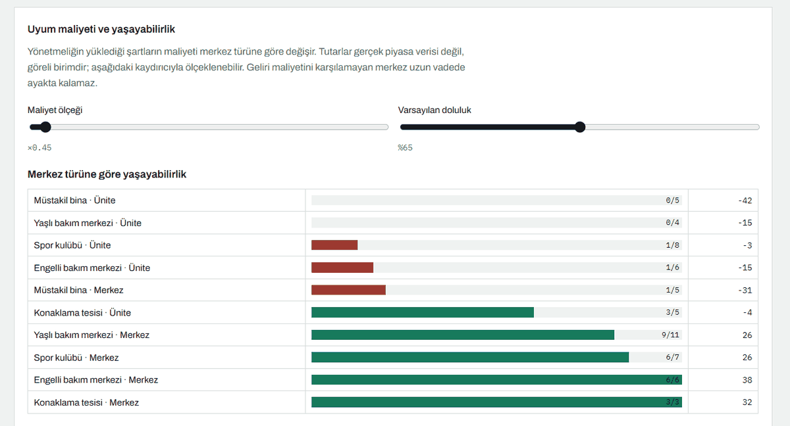
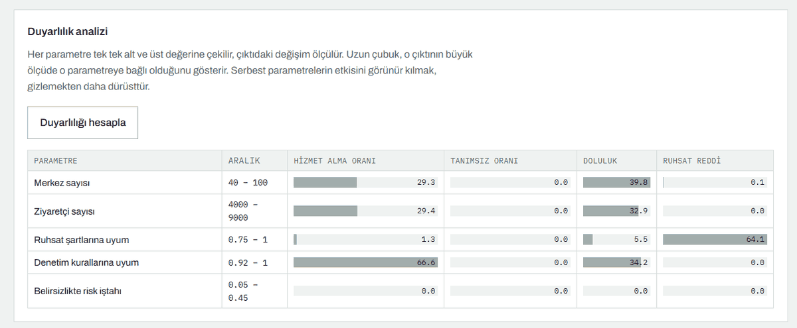
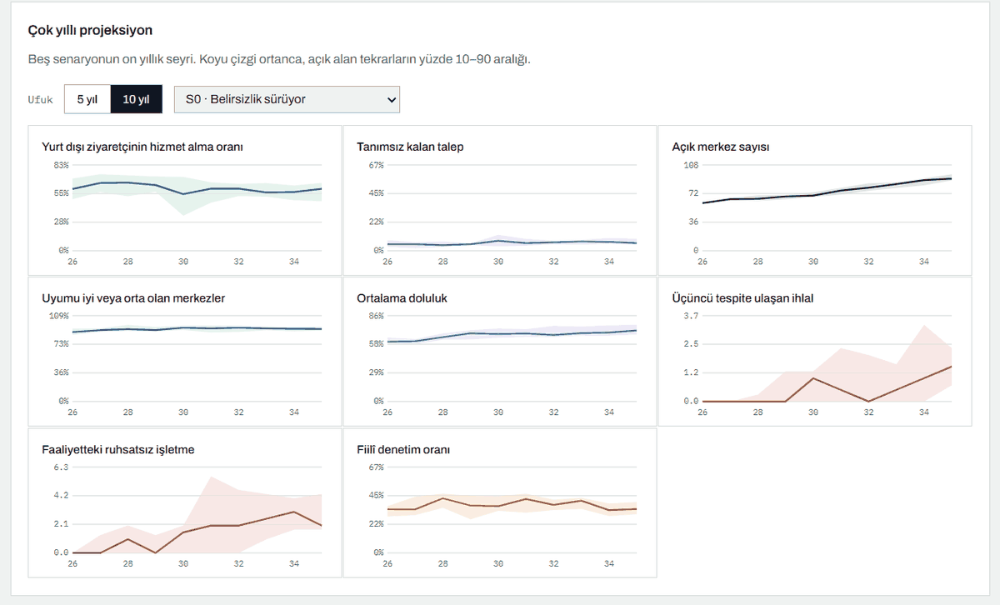
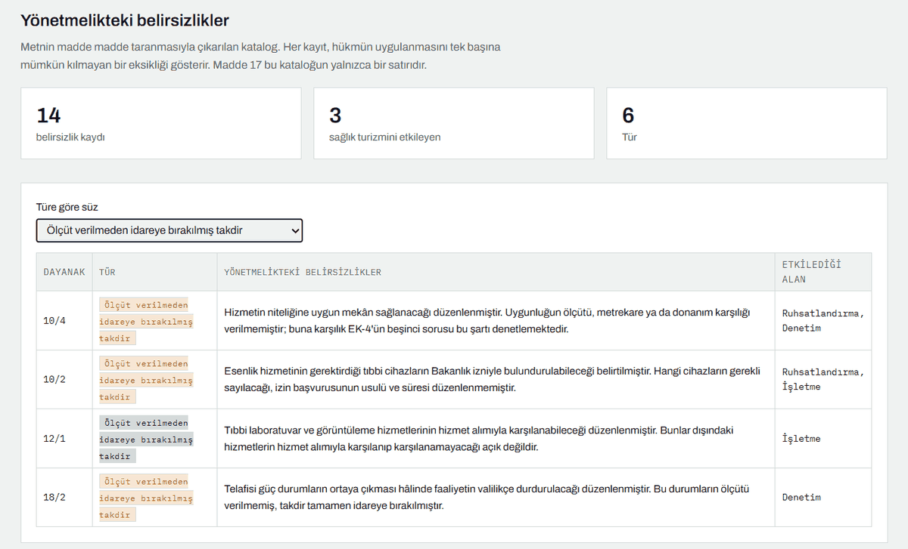
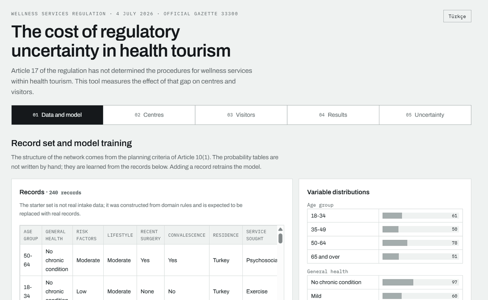

<h1 align="center">TR-Wellness-Regulation-Sim</h1>

<p align="center">
  <strong>Mevzuat belirsizliği ölçülebilir mi?</strong><br>
  Esenlik Hizmetleri Yönetmeliği ve sağlık turizmi üzerine bir düzenleyici etki analizi aracı.
</p>

<p align="center">
  <a href="https://gamze-kose.github.io/TR-Wellness-Regulation-Sim/"><strong>▶ Aracı tarayıcıda açın</strong></a>
  &nbsp;·&nbsp;
  <a href="#nasıl-çalışır">Nasıl çalışır</a>
  &nbsp;·&nbsp;
  <a href="#bulgular">Bulgular</a>
  &nbsp;·&nbsp;
  <a href="#english">English</a>
</p>

<p align="center">
  
  
  
  
</p>


---

## Sorun

Yeni yayımlanan bir yönetmeliğin hükümleri her zaman tek başına uygulanabilir
değildir. Kimi hüküm ikincil düzenlemeye bırakılır, kimi kavram tanımsız kalır,
kimi takdir yetkisi ölçüt verilmeden tanınır. Bu belirsizlikler hukuk
metinlerinde tartışılır ancak ölçülmez.

Esenlik Hizmetleri Yönetmeliği'nin (4 Temmuz 2026, RG 33300) **17 nci maddesi**
sağlık turizmi kapsamındaki hizmetlerin usul ve esaslarını Sağlık Bakanlığına
bırakmış, ikincil düzenleme yayımlanmamış, denetim aracı olan **EK-4'te ise
konuya ilişkin tek bir soru yer almamıştır**. Bir merkez, yurt dışında ikamet
eden ziyaretçiye hizmet verirken kurala uygun mu aykırı mı davrandığını
bilememektedir.

Bu araç, o boşluğu sayıya döker. Sentetik esenlik merkezleri ve sağlık
turistleri üretir, bunları yönetmelikten aktarılan kurallar karşısında
eşleştirir ve **üç değerli** bir sonuç verir:

| | |
|---|---|
| 🟢 **Uygun** | Hiçbir kural ihlal edilmiyor, hizmet verilebilir. |
| 🟣 **Belirsiz** | Kural ihlali yok, ancak Madde 17 usul ve esas belirlemediği için durum tanımsız. |
| 🔴 **Uygun değil** | En az bir kural ihlal ediliyor. |

Üçüncü durum aracın çekirdeğidir. Bir düzenlemenin *eksikliğini* ölçülebilir bir
kategori hâline getirir ve yöntem, başka mevzuata da aktarılabilir.

## Kullanım

Araç tamamen tarayıcıda çalışır. Sunucu, kurulum ya da veri yükleme gerekmez.

**Doğrudan açın:** <https://gamze-kose.github.io/TR-Wellness-Regulation-Sim/>

**Ya da indirin:** `index.html` dosyasını indirip çift tıklayın. Bütün kaynaklar
dosyanın içine gömülüdür; internet bağlantısı olmadan da çalışır.

```bash
git clone https://github.com/gamze-kose/TR-Wellness-Regulation-Sim.git
```

Arayüz Türkçe ve İngilizcedir; sağ üstteki düğmeyle değiştirilir.

---

## Nasıl çalışır

Araç beş adımda ilerler. Her adım bir öncekinin çıktısını kullanır.

### 01 · Veri ve model

Ziyaretçi modelinin öğrendiği kayıt seti burada. Elle yazılmış olasılık tablosu
yoktur; tablolar bu kayıtlardan öğrenilir. Formdan yeni kayıt ekleyebilir, son
kaydı silebilir, tümünü boşaltabilirsiniz — **her değişiklikte model yeniden
eğitilir** ve sağdaki dağılımlar anında güncellenir.



Öğrenilen tablolar denetlenebilir durumdadır. Aşağıda genel sağlık düğümünün
tablosu var: yaş grubu ve yaşam tarzının her bileşimi için ayrı bir satır.
En sağdaki **gözlem** sütunu o satırın kaç kayda dayandığını söyler — beşten az
gözleme dayanan satırlar işaretlenir, çünkü üç kayıttan öğrenilmiş bir olasılık
olasılık değildir.



Modelden tek tek profil çekilebilir. Ağ topolojik sırayla dolaşılır; sağdaki
tablo her düğümde hangi değerin çekildiğini, o değerin olasılığını ve satırın
kaç gözleme dayandığını gösterir. Aşağıdaki örnekte nekahet dönemi 1,00
olasılıkla "hayır" çıkmış, çünkü kişinin yakın cerrahî girişimi yok — model bu
bağımlılığı veriden öğrenmiştir, kurala bağlanmamıştır.


### 02 · Merkezler

Başvurular önce **yapısal kurallardan** geçirilir. Metrekare eşiği, oda sayısı,
kurum izni ve mesul müdür şartlarını sağlamayan başvuru ruhsat alamaz.
Aşağıdaki koşuda 89 başvurudan 60'ı ruhsat almış, 29'u reddedilmiş; red
gerekçeleri madde numarasıyla listelenir. En sık gerekçe mesul müdürün üç yıllık
tabiplik şartıdır (11/4-c).


Ruhsat alanlar **EK-4 denetim kurallarına** göre değerlendirilir. Her kart bir
merkezdir; yerleşim türü, merkez mi ünite mi olduğu ve ihlal sayısı görünür.
Karta tıklayınca hizmet sepeti ve hangi kuralı ihlal ettiği açılır.



Yönetmeliğin yüklediği şartların bir de maliyeti vardır: kapalı alan, acil
müdahale odası, tam zamanlı mesul müdür, hastane iş birliği, bilgi yönetim
sistemi ve Madde 10/8-f'nin ürün satışı yasağından doğan gelir kaybı. Bu
katman, **hangi iş modelinin ayakta kalabildiğini** gösterir. Aşağıdaki tabloda
müstakil binada açılan ünitelerin hiçbiri geliriyle maliyetini karşılayamıyor;
konaklama tesisi ve bakım merkezi bünyesindeki merkezler karşılıyor. Sabit
yükümlülükler küçük ölçeği orantısız etkiler.



### 03 · Ziyaretçiler

Sentetik sağlık turistleri eğitilmiş modelden çekilir ve tek tek merkezlerle
eşleştirilir. Nekahet dönemindeki kişi Madde 10/8-d gereği hizmet alamaz; yurt
dışında ikamet edenlerde Madde 17 devreye girer.

Senaryo seçildiğinde bilgi kutusu açılır: Madde 17'nin durumu, yürürlük yılı,
düzenleme sonrası kabul oranı, denetim oranı ve ünitelerin kapsamda olup
olmadığı. Beş senaryo aynı sentetik nüfusla koşar; aradaki tek fark mevzuattır.


### 04 · Sonuçlar

Her ziyaretçi için sonucu belirleyen hüküm kayıt altına alınır. Aşağıdaki
koşuda ziyaretçilerin %71'i hizmet almış; kalanların bir bölümü aradığı hizmeti
sunan merkez bulamamış, bir bölümü Madde 10/8-d'ye takılmış, bir bölümü de
kapasite dolduğu için hizmet alamamış. Segment kırılımı ikamete, yaşa ve talep
edilen hizmete göre verilir.



Simülasyonun serbest parametreleri vardır ve çıktı bir ölçüde onlara bağlıdır.
Bunu gizlemek yerine ölçüyoruz: her parametre tek tek alt ve üst değerine
çekilir, çıktıdaki değişim kaydedilir. Uzun çubuk, o çıktının büyük ölçüde o
parametreye bağlı olduğunu gösterir.



Beş senaryonun on yıllık seyri. Koyu çizgi ortanca, açık alan tekrarların
yüzde 10–90 aralığıdır. Sekiz gösterge izlenir: yurt dışı ziyaretçinin hizmet
alma oranı, tanımsız kalan talep, açık merkez sayısı, uyum durumu, doluluk,
üçüncü tespite ulaşan ihlal, faaliyetteki ruhsatsız işletme ve fiilî denetim
oranı.



### 05 · Belirsizlik

Yönetmelik metninin madde madde taranmasıyla çıkarılan katalog. **On dört
kayıt, altı tür.** Her kayıt hükmün tek başına uygulanmasını engelleyen bir
eksiği gösterir. Türe göre süzülebilir; aşağıda ölçüt verilmeden idareye
bırakılmış takdir yetkileri listelenmiş durumda.

Madde 17 bu kataloğun **yalnızca bir satırıdır**. Yanında "nekahet dönemi"nin
tanımsız olması (10/8-d), "hizmetin niteliğine uygun mekân" ölçütünün
verilmemesi (10/4), hizmet listesinin açık uçlu bırakılması (4/1-c) ve denetim
formunun yönetmeliğin yapısal tanımlarını hiç sorgulamaması yer alır.



---

## Bulgular

Aşağıdaki sayılar aracın varsayılan ayarlarıyla üretilmiştir ve gerçek veriyle
doğrulanmamıştır. Anlamlı olan mutlak değerler değil, senaryolar arasındaki
farklar ve duyarlılık sıralamasıdır.

- **On dört belirsizlik kaydı** belirlendi; üçü doğrudan sağlık turizmini
  etkiliyor. En sık tür, ölçüt verilmeden bırakılmış takdir yetkisi.
- **Denetim formunun hiçbir sorusu** yönetmeliğin yapısal tanımlarını
  sorgulamıyor. Kapalı alan, oda sayısı, kurum izni ve altmış yaş şartı ruhsat
  aşamasında aranıyor, işletme sırasında denetlenmiyor.
- İkincil düzenlemenin hiç yayımlanmadığı senaryoda yurt dışında ikamet eden
  ziyaretçilerin hizmet alma oranı onuncu yılda **%46**'ya geriliyor ve talebin
  **%11**'i kalıcı olarak tanımsız kalıyor. Düzenlemenin 2028'de yayımlandığı
  senaryolarda oran **%86**'ya çıkıyor.
- Duyarlılık analizine göre **ruhsat şartlarına uyum, ruhsat reddini neredeyse
  tek başına belirliyor** ama ziyaretçilerin hizmete erişimini hemen hiç
  etkilemiyor. Erişimi belirleyen kapasite.
- Uyum maliyeti katmanında **sabit yükümlülükler küçük ölçeği orantısız
  etkiliyor**; müstakil binada açılan üniteler eşiğin altında kalıyor.

---

## Yöntem

**Ziyaretçi modeli.** Ağın yapısı uzman tarafından belirlenir: hangi değişkenler
var, hangisi hangisine bağlı. Değişkenler Madde 10/1'deki kişiye özgü planlama
ölçütlerinden alınmıştır — yaş, genel sağlık durumu, mevcut risk faktörleri ve
yaşam tarzı. Buna Madde 10/8-d gereği nekahet durumu ve Madde 17 gereği ikamet
eklenmiştir. Olasılık tabloları kayıt setinden öğrenilir. Sayımlara düzgün
dağılımlı küçük bir Dirichlet öncülü eklenir; tek amacı hiç gözlem düşmemiş
satırı tanımsız bırakmamaktır ve kayıt sayısı arttıkça etkisi kaybolur.

**Kural motoru.** EK-4 denetim formundaki 21 soru ile yönetmelik maddelerinden
türetilen 12 yapısal kural uygulanır. İki küme farklı anlarda işler: yapısal
kurallar ruhsat aşamasında, EK-4 kuralları işletme sırasında.

**Yaptırım merdiveni.** EK-4 her kural için birinci, ikinci ve üçüncü tespitte
ayrı yaptırım tanımlar. Merkezler tek tek izlenir ve her birinin kendi tespit
sayaçları tutulur; merdiven ancak böyle işleyebilir, ortalamaya indirgenirse
anlamını yitirir.

**Düzenleyici etki katmanları.** Uyum maliyetleri, ruhsat alamayan işletmelerin
kayıt dışı faaliyet dalı, sınırlı denetim kapasitesi ve her parametre için
duyarlılık analizi.

---

## Uyarılar

> **Bu bir öngörü değildir.** Bir aylık bir sektörün on yıllık seyrini kestirecek
> veri yoktur. Giriş oranı, talep büyümesi, uyum davranışı ve maliyet tutarları
> varsayımdır. Sonuçlar tek bir kestirim yerine tekrarların ortancası ve yüzde
> 10–90 aralığı olarak raporlanır.

> **Veri sentetiktir.** Tüm merkezler ve ziyaretçiler üretilmiştir. Gerçek kişi
> ya da kuruluş verisi kullanılmaz. `veri/ornek_kayitlar.json` gerçek başvuru
> kaydı değil, alan bilgisine dayanan kurallarla kurgulanmış bir başlangıç
> setidir ve gerçek kayıtlarla değiştirilmesi beklenir.

> **Bağlayıcı metin Resmî Gazete'dir.** Kural setleri yönetmelikten
> aktarılmıştır; hukuki bir yorum ya da danışmanlık değildir.

---

## Dosyalar

| Yol | İçerik |
|---|---|
| `index.html` | Tek dosyalık arayüz, doğrudan açılır |
| `sablon.html` · `paketle.py` | Arayüz kaynağı ve paketleyici |
| `mevzuat/ek4_denetim.json` | EK-4 denetim formunun 21 kuralı |
| `mevzuat/yapisal_kurallar.json` | Madde metinlerinden türetilen 12 kural |
| `mevzuat/belirsizlik_haritasi.json` | 14 kayıtlık belirsizlik kataloğu |
| `mevzuat/uyum_maliyeti.json` | 8 kalemlik uyum maliyeti |
| `mevzuat/hizmetler.json` | Madde 4/1-c'deki 24 hizmet |
| `mevzuat/ag_yapisi.json` | Ziyaretçi ağının yapısı |
| `mevzuat/senaryolar.json` | Beş mevzuat senaryosu |
| `veri/` | Başlangıç kayıt seti ve üreten betik |
| `web/model.js` | Bayes ağı ve veriden öğrenme |
| `web/akis.js` | Merkez üretimi, kural denetimi, eşleştirme |
| `web/analiz.js` | Uyum maliyeti ve duyarlılık analizi |
| `cekirdek/` | Çok yıllı simülasyon (Python) |
| `gorseller/` | README ekran görüntüleri |

### Geliştirme

```bash
python3 veri/uret_ornek.py   # başlangıç kayıt setini yeniden üretir
python3 calistir.py          # beş senaryoyu komut satırında koşturur
python3 onhesap.py           # projeksiyonları hesaplar
python3 paketle.py           # index.html dosyasını yeniden üretir
```

Çekirdek yalnızca standart kütüphaneye bağlıdır; kurulum gerekmez.

---

## İlgili bildiri

> Köse, G. & Köse, U. (2026). Measuring Uncertainty: An Artificial Intelligence
> Assisted Regulatory Impact Analysis of the Wellness Services Regulation and
> Health Tourism. *INNOVAHEALTH 2026 — 3rd International Congress on Innovative
> Approaches in Health Sciences*, 2–5 Eylül 2026, Girne, KKTC.

## Lisans

MIT — ayrıntı için [LICENSE](LICENSE).

<br>

---
<br>

<h1 align="center" id="english">TR-Wellness-Regulation-Sim</h1>

<p align="center">
  <strong>Can regulatory uncertainty be measured?</strong><br>
  A regulatory impact analysis tool for Turkey's Wellness Services Regulation and health tourism.
</p>

<p align="center">
  <a href="https://gamze-kose.github.io/TR-Wellness-Regulation-Sim/"><strong>▶ Open the tool in your browser</strong></a>
</p>


## The problem

The provisions of a newly published regulation are not always applicable on
their own. Some are deferred to secondary regulation, some concepts are left
undefined, some discretion is granted without criteria. Such uncertainties are
debated in legal texts but not measured.

Article 17 of the Wellness Services Regulation (4 July 2026, Official Gazette
33300) defers the procedures for wellness services within health tourism to the
Ministry of Health, that secondary regulation has not been issued, and **Annex 4,
the inspection instrument, contains no question on it**. A centre cannot know
whether serving a visitor resident abroad complies with the rules.

The tool turns that gap into a number. It generates synthetic wellness centres
and health tourists, matches them against rules transcribed from the regulation
and returns a **three-valued** outcome:

| | |
|---|---|
| 🟢 **Compliant** | No rule is violated; service can be provided. |
| 🟣 **Undefined** | No rule is violated, but the status is undetermined because Article 17 has set no procedures. |
| 🔴 **Non-compliant** | At least one rule is violated. |

The third state is the core of the tool. It turns the *absence* of a provision
into a measurable category, and the method transfers to other legislation.

## Usage

The tool runs entirely in the browser. No server, installation or data upload
is required.

**Open it directly:** <https://gamze-kose.github.io/TR-Wellness-Regulation-Sim/>

**Or download:** grab `index.html` and double-click it. All resources are
embedded in the file; it works without an internet connection.

The interface is available in Turkish and English via the button at the top
right.

## The five steps

**01 · Data and model.** The record set the visitor model learns from. There are
no hand-written probability tables; the tables are learned from these records.
Adding or deleting a record retrains the model immediately. The learned tables
are inspectable, and each row shows how many observations it rests on — rows
below five are flagged, because a probability learned from three records is not
a probability. Individual profiles can be drawn from the model and the draw is
traced node by node.

**02 · Centres.** Applications first pass the structural rules; those failing
area, room, permit or responsible-manager conditions receive no licence, and the
grounds for refusal are listed with their article references. Licensed centres
are then assessed against the Annex 4 inspection rules. A compliance cost layer
prices the obligations the regulation imposes and shows which business models
remain viable — fixed obligations affect small operators disproportionately.

**03 · Visitors.** Synthetic health tourists are drawn from the trained model and
matched against the centres one by one. A person in convalescence is ineligible
under Article 10(8)(d); for those resident abroad, Article 17 comes into play.
Five scenarios run on the same synthetic population; the only difference between
them is the regulation.

**04 · Results.** The provision determining the outcome is recorded for every
visitor, with breakdowns by residence, age and service sought. A sensitivity
analysis moves each free parameter to its lower and upper bound and measures the
change, and a ten-year projection tracks eight indicators across the five
scenarios.

**05 · Uncertainty.** A catalogue of fourteen entries across six types, produced
by reading the regulation article by article. Article 17 is only one line of it.

## Findings

The figures below come from the tool's default settings and are not validated
against real data. What matters is not the absolute values but the differences
between scenarios and the ranking of sensitivities.

- **Fourteen uncertainty entries** were identified, three bearing directly on
  health tourism; the most frequent type is discretion without criteria.
- **No inspection question** addresses the structural definitions of the
  regulation.
- Where the deferred regulation is never issued, the share of visitors resident
  abroad obtaining service falls to **46%** by the tenth year and **11%** of
  demand remains undefined; where it is issued in 2028, the share rises to
  **86%**.
- Compliance with licensing conditions **almost wholly determines licence
  refusal** yet barely affects access to services, which is governed by capacity.

## Method

**Visitor model.** The structure of the network is set by domain expertise. The
variables come from the individual planning criteria of Article 10(1) — age,
general health status, existing risk factors and lifestyle — extended with
convalescence under Article 10(8)(d) and residence under Article 17. The
probability tables are learned from the record set. A small uniform Dirichlet
prior is added to the counts, solely so that rows with no observations are not
left undefined; its influence vanishes as records accumulate.

**Rule engine.** Twenty-one inspection questions from Annex 4 and twelve
structural rules derived from the articles. The two sets act at different
moments: structural rules at licensing, Annex 4 rules during operation.

**Sanction ladder.** Annex 4 defines a distinct sanction for the first, second
and third detection of each rule. Centres are tracked individually with their
own detection counters; the ladder can only operate this way and loses its
meaning if reduced to an average.

**Regulatory impact layers.** Compliance costs, an unlicensed operation branch
for refused applications, limited inspection capacity, and a sensitivity
analysis over every parameter.

## Caveats

> **This is not a forecast.** There is no data to project a sector one month old
> across ten years. Entry rate, demand growth, compliance behaviour and cost
> figures are assumptions. Results are reported as the median and the 10–90
> percentile range across repetitions rather than as a single estimate.

> **The data is synthetic.** All centres and visitors are generated. No real
> person or institution data is used. `veri/ornek_kayitlar.json` is not real
> intake data but a starter set constructed from domain rules, expected to be
> replaced with real records.

> **The binding text is the Official Gazette.** The rule sets are transcriptions
> of the regulation and constitute neither legal interpretation nor advice.

## Development

```bash
python3 veri/uret_ornek.py   # regenerate the starter record set
python3 calistir.py          # run the five scenarios on the command line
python3 onhesap.py           # compute the projections
python3 paketle.py           # rebuild index.html
```

The core depends only on the standard library; no installation is needed.

## Related paper

> Köse, G. & Köse, U. (2026). Measuring Uncertainty: An Artificial Intelligence
> Assisted Regulatory Impact Analysis of the Wellness Services Regulation and
> Health Tourism. *INNOVAHEALTH 2026 — 3rd International Congress on Innovative
> Approaches in Health Sciences*, 2–5 September 2026, Kyrenia, TRNC.

## License

MIT — see [LICENSE](LICENSE).
