<h1 align="center">TR-Wellness-Regulation-Sim</h1>

<p align="center">
  <strong>Temel soru: "Mevzuat belirsizliği ölçülebilir mi?"</strong><br>
  Esenlik Hizmetleri Yönetmeliği ve sağlık turizmi üzerine<br>
  yapay zekâ destekli bir düzenleyici etki analizi aracı.
</p>

<p align="center">
  <a href="https://gamze-kose.github.io/TR-Wellness-Regulation-Sim/"><strong>▶ Aracı tarayıcıda açın</strong></a>
  &nbsp;·&nbsp;
  <a href="#yöntem-ve-teknikler">Yöntem</a>
  &nbsp;·&nbsp;
  <a href="#nasıl-çalışır">Nasıl çalışır</a>
  &nbsp;·&nbsp;
  <a href="#bulgular">Bulgular</a>
  &nbsp;·&nbsp;
  <a href="#english">English</a>
</p>

<p align="center">
  
  
  
  
  <br>
  
  
  
  
</p>


---

## Sorun

Yeni yayımlanan bir yönetmeliğin hükümleri her zaman tek başına uygulanabilir
değildir. Kimi hükmün uygulama ölçütü idarenin belirlemesine bırakılır, kimi
kavram tanımsız kalır, kimi takdir yetkisi ölçüt verilmeden tanınır. Bu
belirsizlikler hukuk metinlerinde tartışılır ancak ölçülmez.

Esenlik Hizmetleri Yönetmeliği'nin (4 Temmuz 2026, RG 33300) **17 nci maddesi**,
esenlik merkez ve ünitelerinin uluslararası sağlık turizmi yetkisini Sağlık
Bakanlığının belirlemesine bırakmıştır. Uluslararası Sağlık Turizmi ve Turistin
Sağlığı Hakkında Yönetmelik (26 Nisan 2025, RG 32882) bu alanda yetki belgesi
almayı zorunlu kılar; ancak esenlik merkezi ruhsatının o yönetmelikteki sağlık
tesisi tanımını karşılayıp karşılamadığı belirlenmemiştir. **Esenlik Hizmetleri
Yönetmeliği EK-4'ünde ise konuya ilişkin tek bir soru yer almamıştır**. Bir
merkez, yurt dışında ikamet eden ziyaretçiye hizmet verirken yetkili olup
olmadığını bilememektedir.

Bu araç, o boşluğu sayıya döker. Sentetik esenlik merkezleri ve sağlık
turistleri üretir, bunları yönetmelikten aktarılan kurallar karşısında
eşleştirir ve **üç değerli** bir sonuç verir:

| | |
|---|---|
| 🟢 **Uygun** | Hiçbir kural ihlal edilmiyor, hizmet verilebilir. |
| 🟣 **Belirsiz** | Kural ihlali yok, ancak yönetmelikteki bir eksiklik nedeniyle durum tanımsız. Dört ayrı hükümden doğabilir. |
| 🔴 **Uygun değil** | En az bir kural ihlal ediliyor. |

Üçüncü durum aracın çekirdeğidir. Bir düzenlemenin *eksikliğini* ölçülebilir bir
kategori hâline getirir ve yöntem, başka mevzuata da aktarılabilir.

## Yöntem ve teknikler

Araç, sembolik ve olasılıksal yapay zekâ yöntemlerini bir arada kullanır. Hiçbir
bileşen kara kutu değildir: öğrenilen tablolar, uygulanan kurallar ve çekim izi
arayüzden tek tek denetlenebilir.

| Teknik | Nerede | Dosya |
|---|---|---|
| **Kural tabanlı çıkarım** (sembolik yapay zekâ) | EK-4'ün 21 denetim sorusu ve maddelerden türetilen 12 yapısal kural | `web/akis.js` · `cekirdek/kural.py` |
| **Üç değerli mantık** | Uygun / uygun değil / belirsiz. Mevzuat boşluğunu ölçülebilir bir kategoriye çevirir | `web/akis.js` |
| **Ayrık Bayes ağı** (olasılıksal grafik model) | Sentetik ziyaretçi üretimi; topolojik sırayla ileri yönlü örnekleme | `web/model.js` · `cekirdek/ag.py` |
| **Dirichlet öncüllü parametre öğrenmesi** | Koşullu olasılık tabloları elle yazılmaz, kayıt setinden kestirilir | `web/model.js` · `cekirdek/ogren.py` |
| **Etmen temelli simülasyon** | Merkezler tek tek izlenen etmenler; kendi durumu, sepeti ve tespit sayaçları | `cekirdek/simulasyon.py` · `cekirdek/merkez.py` |
| **Markov zinciri** | Uyum durumunun yıldan yıla geçişi; ceza alan merkez farklı matris kullanır | `cekirdek/simulasyon.py` |
| **Monte Carlo tekrarları** | Tek kestirim yerine ortanca ve yüzde 10–90 bandı | `cekirdek/gostergeler.py` |
| **Tek değişkenli duyarlılık analizi** | Her parametre alt ve üst değerine çekilip çıktıdaki değişim ölçülür | `web/analiz.js` |
| **Deneysel tasarım ve tabakalı örnekleme** | Merkez konfigürasyonları üretken modelle değil, hukuken ayırt edilebilir sınıflar üzerinden | `web/akis.js` |
| **Geri beslemeli talep dinamiği** | Karşılanamayan talep büyüdükçe ruhsat başvurusu artar, kapasite fazlalaştıkça azalır | `cekirdek/simulasyon.py` |

Çekim, üretim ve simülasyonun tamamı **yinelenebilirdir**: aynı yineleme
anahtarı aynı sonucu verir ve hiçbir çıktı bir dil modeline bağlı değildir.

## Kullanım

Araç tamamen tarayıcıda çalışır. Sunucu, kurulum ya da veri yükleme gerekmez.

**Doğrudan açın:** <https://gamze-kose.github.io/TR-Wellness-Regulation-Sim/>

**Ya da indirin:** `index.html` dosyasını indirip çift tıklayın. Bütün kaynaklar
dosyanın içine gömülüdür; internet bağlantısı olmadan da çalışır.

```bash
git clone https://github.com/gamze-kose/TR-Wellness-Regulation-Sim.git
```

Arayüz Türkçe ve İngilizcedir; sağ üstteki düğmeyle değiştirilir.

---

## Nasıl çalışır

Beş adım, her biri bir öncekinin çıktısını kullanır.

### 01 · Veri ve model

Ziyaretçi modelinin öğrendiği kayıt seti burada. Elle yazılmış olasılık tablosu
yoktur; tablolar bu kayıtlardan öğrenilir. Soldaki tablodan son kaydı silebilir,
başlangıç setine dönebilir ya da tümünü boşaltabilirsiniz; alttaki formdan yeni
kayıt eklersiniz. **Her değişiklikte model yeniden eğitilir** ve sağdaki
dağılımlar anında güncellenir — aşağıda 240 kaydın yaş, genel sağlık, risk,
yaşam tarzı, yakın cerrahî ve nekahet dağılımları görünüyor.


Öğrenilen tablolar denetlenebilir durumdadır. Aşağıda genel sağlık düğümünün
tablosu var: yaş grubu ve yaşam tarzının her bileşimi için ayrı bir satır, on iki
satır toplam. En sağdaki **gözlem** sütunu o satırın kaç kayda dayandığını
söyler — beşten az gözleme dayanan satırlar işaretlenir, çünkü üç kayıttan
öğrenilmiş bir olasılık olasılık değildir. Örnekte 35-49 yaş ve hareketsiz
yaşam tarzı satırı yalnızca 11 gözleme dayanıyor.

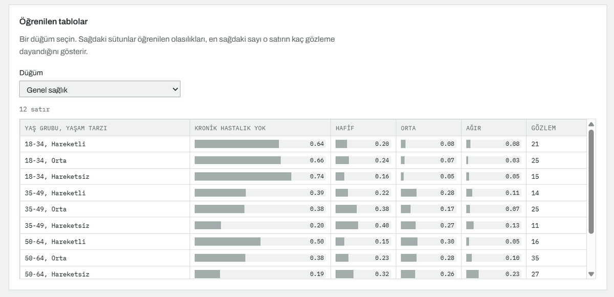

Modelden tek tek profil çekilebilir. Ağ topolojik sırayla dolaşılır; sağdaki
tablo her düğümde hangi değerin çekildiğini, o değerin olasılığını ve satırın
kaç gözleme dayandığını gösterir. Aşağıdaki çekimde nekahet dönemi **1,00**
olasılıkla "hayır" çıkmış, çünkü kişinin yakın cerrahî girişimi yok. Model bu
bağımlılığı kuraldan değil veriden öğrenmiştir.


### 02 · Merkezler

Başvurular önce **yapısal kurallardan** geçirilir: metrekare eşiği, oda sayısı,
kurum izni ve mesul müdür şartları. Ruhsat kararı üç değerlidir. Aşağıdaki
koşuda 60 başvuru ruhsat almış, 27'si reddedilmiş, **11'i askıda kalmıştır**:
Madde 10/4 hizmetin niteliğine uygun mekân arar ancak ölçütünü vermediği için bu
başvurularda ruhsat ne verilebilir ne reddedilebilir. Ruhsat alanların 2'sinde
faaliyet durdurulmuş, 12'sinde ihlal bulunmasına karşın faaliyet sürmektedir.
Red gerekçeleri madde numarasıyla listelenir; en sık gerekçe mesul müdürün üç
yıllık tabiplik şartıdır (11/4-c), onu mesul müdürün başka kurumda çalışamaması
(11/6) izler.

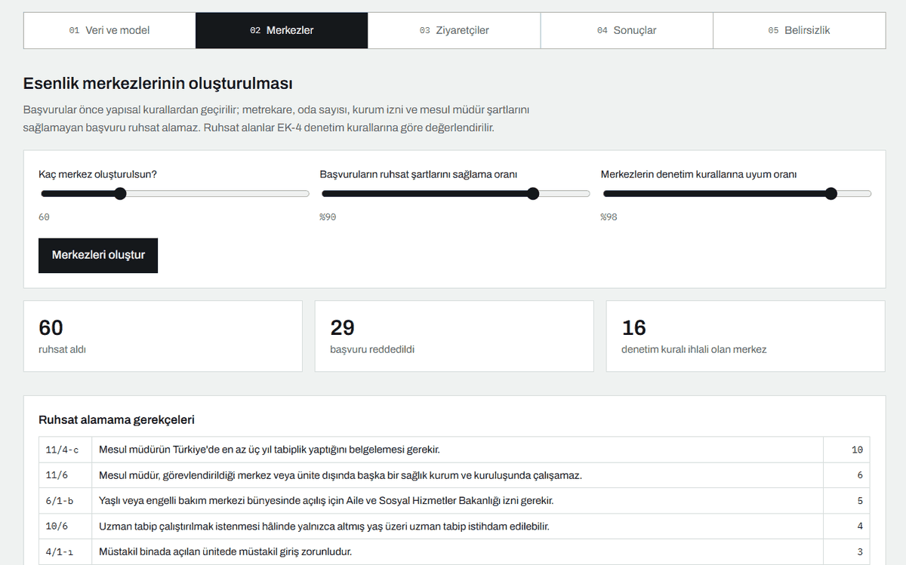

Ruhsat alanlar **EK-4 denetim kurallarına** göre değerlendirilir. Her kart bir
merkezdir ve üç durumdan birini gösterir: ihlal yok, ihlal var ancak faaliyet
sürüyor, faaliyet durduruldu. EK-4 kuralların çoğunda birinci tespitte uyarı ve
idarî para cezası öngörür; merkez çalışmaya devam eder. Yalnızca birinci
tespitinde faaliyet durdurulması öngörülen iki kuralda merkez eşleştirmeye
giremez. Karta tıklayınca hizmet sepeti ve ihlal ettiği kurallar açılır.

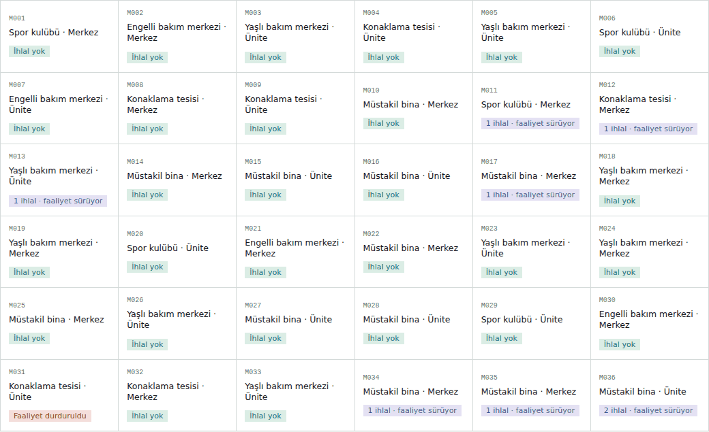

Yönetmeliğin yüklediği şartların bir de maliyeti vardır. Bu katman **hangi iş
modelinin ayakta kalabildiğini** gösterir. Aşağıdaki tabloda müstakil binada
açılan ünitelerin hiçbiri (0/4) ve müstakil binadaki merkezlerin yalnızca biri
(1/5) geliriyle maliyetini karşılayabiliyor; buna karşılık konaklama tesisi
(5/5), engelli bakım merkezi (6/6) ve yaşlı bakım merkezi (8/9) bünyesindeki
merkezlerin neredeyse tamamı karşılıyor. Sabit yükümlülükler küçük ölçeği
orantısız etkiler.

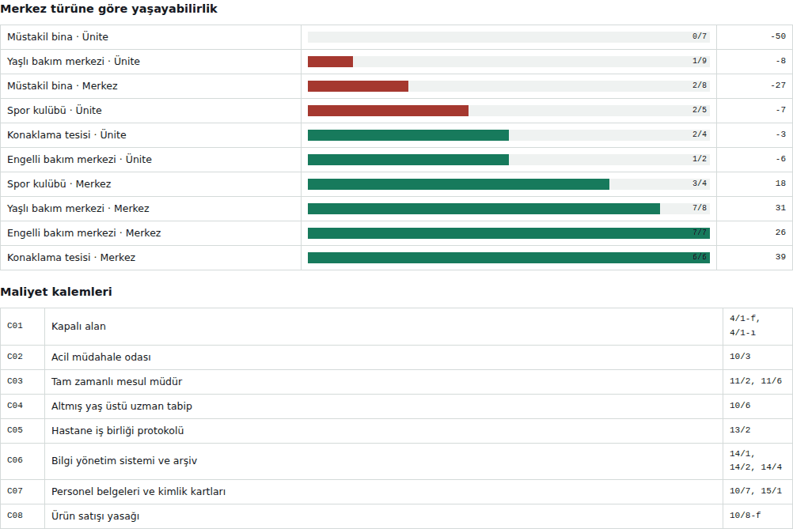

Maliyet kalemlerinin her biri bir hükme bağlıdır: kapalı alan (4/1-f, 4/1-ı),
acil müdahale odası (10/3), tam zamanlı mesul müdür (11/2, 11/6), altmış yaş
üstü uzman tabip (10/6), hastane iş birliği (13/2), bilgi yönetim sistemi
(14/1, 14/2, 14/4), personel belgeleri (10/7, 15/1) ve ürün satışı yasağının
doğurduğu gelir kaybı (10/8-f).

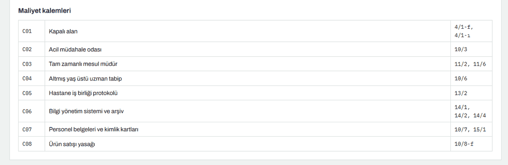

### 03 · Ziyaretçiler

Sentetik sağlık turistleri eğitilmiş modelden çekilir ve tek tek merkezlerle
eşleştirilir. Hizmet alamama iki kaynaktan doğar: nekahet yasağı (Madde 10/8-d)
bir mevzuat kuralıdır; hizmeti sunan merkez bulunmaması ve kapasitenin dolması
ise arz ile talebin buluşmamasıdır. **Tanımsız sonuç ise üç ayrı eksiklikten
doğar:** yurt dışı ikamette Madde 17 kapsamındaki belirlemenin yapılmamış
olması, nekahet döneminin tanımsızlığı (Madde 10/8-d) ve tedavi amacının
ölçütsüzlüğü (Madde 4/1-c). Yalnızca birincisi senaryolarla çözülür.

Senaryo seçildiğinde bilgi kutusu açılır: Madde 17'nin durumu, yürürlük yılı,
belirleme sonrası kabul oranı, denetim oranı ve ünitelerin kapsamda olup
olmadığı. Aşağıda **S0 — Belirsizlik sürüyor** senaryosu; Madde 17 kapsamındaki
belirleme hiç yapılmıyor ve sonuç şeridinde mor bir **Tanımsız %15** bandı
beliriyor.


Aynı ekran **S1 — İzin verici belirleme** ile. Belirleme 2028'de yapılıyor ve
mor bant **%15'ten %7'ye** iniyor, ancak sıfırlanmıyor. İki koşuda ziyaretçi
sayısı da, diğer bütün ayarlar da aynıdır; değişen tek şey senaryodur.

Kalan %7 çalışmanın en dikkat çekici bulgusudur: **Madde 17 çözülse bile
belirsizlik tümüyle ortadan kalkmaz**, çünkü nekahet döneminin tanımsızlığı ile
tedavi amacının ölçütsüzlüğü hiçbir senaryoyla çözülmez.

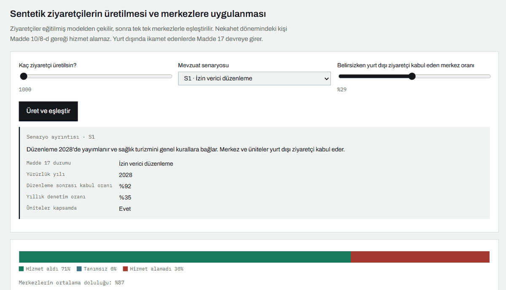

### 04 · Sonuçlar

Bu adımda üç ayrı kaynak vardır: eşleştirme sonuçları ve segment kırılımı az
önceki koşudan gelir, duyarlılık analizi kendi sabit taban değerleriyle ayrıca
hesaplanır, çok yıllı projeksiyon ise önceden hesaplanmıştır ve oturumdaki
ayarlardan etkilenmez.

Her ziyaretçi için sonucu belirleyen hüküm kayıt altına alınır. Aşağıdaki
koşuda ziyaretçilerin %76'sı hizmet almış; %15'i hizmeti sunan merkezlerin
kapasitesi dolu olduğu için, %9'u ise Madde 10/8-d gereği hizmet alamamıştır.
Bu ayrım politika açısından belirleyicidir: kapasite darlığı, hizmet çeşitliliği
eksikliği ve hukuki engel bambaşka müdahaleler gerektirir. Segment kırılımı
ikamete, yaşa ve talep edilen hizmete göre verilir — termal ve balneoloji
talebinin karşılanma oranının belirgin biçimde düşük olması, bu arketipin
çekirdek hizmetlerinden en az ikisinin aynı merkezde bulunması gerekmesinden
kaynaklanan bir arz sorununu gösterir.

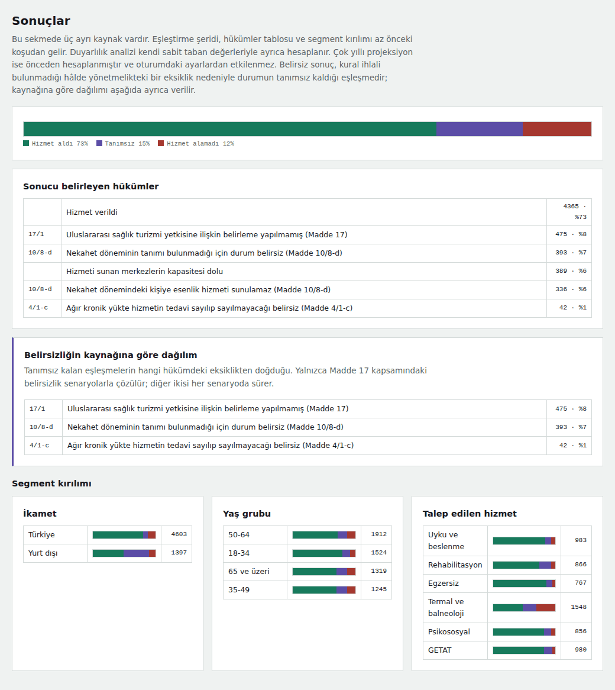

Simülasyonun serbest parametreleri vardır ve çıktı bir ölçüde onlara bağlıdır.
Bunu gizlemek yerine ölçüyoruz: her parametre tek tek alt ve üst değerine
çekilir, çıktıdaki değişim kaydedilir. Aşağıdaki tabloda **ruhsat şartlarına
uyum** satırı ruhsat reddi sütununda 63,3 ile en uzun çubuğa sahipken hizmet
alma oranı sütununda yalnızca 6,3; yani ruhsat şartları kimin sektöre
girebileceğini belirliyor, kimin hizmet alabileceğini değil.

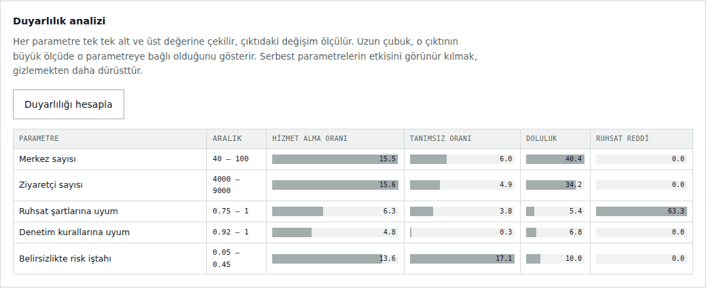

**Bu bölüm ürettiğiniz merkez ve ziyaretçilerle ilgili değildir.** Beş
senaryonun on yıllık seyri Python tarafında önceden hesaplanıp sayfaya
gömülmüştür; simülasyon her yıl kendi merkezlerini ve ziyaretçilerini yeniden
üretir. Koyu çizgi ortanca, açık alan tekrarların yüzde 10–90 aralığıdır. Sekiz gösterge izlenir: yurt dışı ziyaretçinin hizmet alma
oranı, tanımsız kalan talep, açık merkez sayısı, uyum durumu, ortalama doluluk,
üçüncü tespite ulaşan ihlal, faaliyetteki ruhsatsız işletme ve fiilî denetim
oranı. Son iki gösterge yönetmeliğin dolaylı etkilerini yakalar: ruhsat
alamayanların bir bölümü kayıt dışı çalışır, denetim kapasitesi sınırlı olduğu
için sektör büyüdükçe fiilî denetim oranı hedefin altına düşer.


### 05 · Belirsizlik

Yönetmelik metninin madde madde taranmasıyla çıkarılan katalog: **on dört kayıt,
altı tür**, üçü doğrudan sağlık turizmini etkiliyor. Her kayıt hükmün tek başına
uygulanmasını engelleyen bir eksiği gösterir ve türe göre süzülebilir.

**Bu on dört kayıttan dördü simülasyona bağlıdır.** Madde 17 kapsamındaki
belirleme, nekahet döneminin tanımsızlığı ve tedavi amacının ölçütsüzlüğü
eşleştirme aşamasında; mekân uygunluğunun ölçütsüzlüğü (Madde 10/4) ise ruhsat
aşamasında tanımsız sonuç üretir. Yalnızca Madde 17 kapsamındaki belirsizlik
senaryolarla çözülür; **diğer üçü her senaryoda sürer.** Kalan on kayıt
belirlenmiş ancak modellenmemiştir.

Aşağıda ölçüt verilmeden idareye bırakılmış takdir yetkileri süzülmüş durumda:
"hizmetin niteliğine uygun mekân" ölçütünün verilmemesi (10/4 — buna karşılık
EK-4'ün beşinci sorusu bu şartı denetliyor), tıbbi cihaz izninin usulünün
düzenlenmemesi (10/2), hizmet alımı sınırının belirsizliği (12/1) ve "telafisi
güç durumlar" ifadesinin ölçütsüzlüğü (18/2). **Madde 17 bu kataloğun yalnızca
bir satırıdır.**

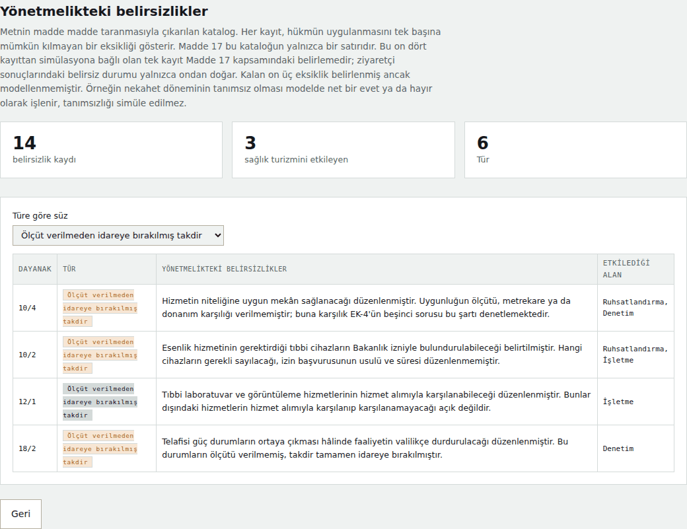

---

## Bulgular

Aşağıdaki sayılar aracın varsayılan ayarlarıyla üretilmiştir ve gerçek veriyle
doğrulanmamıştır. Anlamlı olan mutlak değerler değil, senaryolar arasındaki
farklar ve duyarlılık sıralamasıdır.

- **On dört belirsizlik kaydı** belirlendi; üçü doğrudan sağlık turizmini
  etkiliyor. En sık tür, ölçüt verilmeden bırakılmış takdir yetkisi.
- **Denetim formunun hiçbir sorusu** yönetmeliğin yapısal tanımlarını
  sorgulamıyor. Kapalı alan, oda sayısı, kurum izni ve altmış yaş şartı ruhsat
  aşamasında aranıyor, işletme sırasında denetlenmiyor.
- Madde 17 kapsamındaki belirlemenin hiç yapılmadığı senaryoda yurt dışında
  ikamet eden ziyaretçilerin hizmet alma oranı onuncu yılda **%59**'a geriliyor
  ve talebin **%12**'si tanımsız kalıyor. Belirlemenin 2028'de yapıldığı
  senaryolarda oran **%80**'e çıkıyor, ancak talebin **%6**'sı hâlâ tanımsız
  kalıyor: nekahet döneminin tanımsızlığı ile tedavi amacının ölçütsüzlüğü
  hiçbir senaryoyla çözülmüyor.
- Duyarlılık analizine göre **ruhsat şartlarına uyum, ruhsat reddini neredeyse
  tek başına belirliyor** ama ziyaretçilerin hizmete erişimini hemen hiç
  etkilemiyor. Erişimi belirleyen kapasite.
- Uyum maliyeti katmanında **sabit yükümlülükler küçük ölçeği orantısız
  etkiliyor**; müstakil binada açılan üniteler eşiğin altında kalıyor.

---

## Yöntemin ayrıntısı

### Olasılıksal katman: Bayes ağı ve veriden öğrenme

Ziyaretçi modeli sekiz düğümlü ayrık bir Bayes ağıdır. **Yapı** uzman tarafından
belirlenir — hangi değişkenler var, hangisi hangisine bağlı. Değişkenler Madde
10/1'deki kişiye özgü planlama ölçütlerinden alınmıştır: yaş, genel sağlık
durumu, mevcut risk faktörleri ve yaşam tarzı. Buna Madde 10/8-d gereği nekahet
durumu ve Madde 17 gereği ikamet eklenmiştir.

**Parametreler** ise veriden kestirilir. Her düğümün her ebeveyn bileşimi için
sayımlar tutulur, bunlara düzgün dağılımlı küçük bir Dirichlet öncülü eklenir ve
sonsal ortalama tabloyu oluşturur. Öncülün tek amacı hiç gözlem düşmemiş satırı
tanımsız bırakmamaktır; kayıt sayısı arttıkça etkisi kaybolur. Az gözleme
dayanan satırlar arayüzde işaretlenir.

Üretim ileri yönlü örneklemedir: ağ topolojik sırayla dolaşılır, her düğümde
ebeveyn değerlerine karşılık gelen satırdan çekim yapılır. Çekim izi adım adım
kaydedilir ve gösterilir.

### Sembolik katman: kural tabanlı çıkarım ve üç değerli mantık

EK-4 denetim formundaki 21 soru ile yönetmelik maddelerinden türetilen 12
yapısal kural, madde referanslarıyla birlikte makine okunabilir biçimde
kodlanmıştır. İki küme farklı anlarda işler: **yapısal kurallar ruhsat
aşamasında**, **EK-4 kuralları işletme sırasında**.

Çıkarımın sonucu ikili değil üç değerlidir. Bir kural ihlal edilirse *uygun
değil*; ihlal yoksa ancak yönetmelikteki bir eksiklik devredeyse *belirsiz*;
ikisi de yoksa
*uygun*. Üçüncü değer bir modelleme kolaylığı değil, mevzuatın kendi
eksikliğinin karşılığıdır.

### Etmen temelli katman: yaptırım merdiveni ve Markov geçişleri

Merkezler tek tek izlenen etmenlerdir; her birinin kendi ruhsat tarihi, hizmet
sepeti, zayıf noktaları ve **EK-4 kurallarının her biri için ayrı tespit
sayacı** vardır. Bu şart: form birinci, ikinci ve üçüncü tespitte farklı
yaptırım tanımladığı için merdiven ancak sayaçlar merkez bazında tutulursa
işler, ortalamaya indirgenirse anlamını yitirir.

Uyum durumu üç kademeli bir Markov zinciri izler (iyi, orta, zayıf). Geçiş
olasılıkları o yıl ceza alınıp alınmadığına göre iki ayrı matristen okunur;
ceza alan merkez toparlanma yönünde daha yüksek olasılık taşır.

### Belirsizlik ve düzenleyici etki katmanları

Sonuçlar **Monte Carlo tekrarlarıyla** üretilir ve tek bir kestirim yerine
ortanca ile yüzde 10–90 bandı raporlanır. **Tek değişkenli duyarlılık analizi**
her parametreyi tek tek alt ve üst değerine çekip çıktıdaki değişimi ölçer;
böylece hangi sonucun hangi varsayıma bağlı olduğu görünür kalır.

Düzenleyici etki tarafında üç katman daha vardır: uyum maliyetleri, ruhsat
alamayan işletmelerin kayıt dışı faaliyet dalı ve sınırlı denetim kapasitesi.
Sonuncusu sektör büyüdükçe fiilî denetim oranının hedefin altına düşmesine yol
açar.

---

## Uyarılar

> **Bu bir öngörü değildir.** Bir aylık bir sektörün on yıllık seyrini kestirecek
> veri yoktur. Giriş oranı, talep büyümesi, uyum davranışı ve maliyet tutarları
> varsayımdır. Sonuçlar tek bir kestirim yerine tekrarların ortancası ve yüzde
> 10–90 aralığı olarak raporlanır.

> **Veri sentetiktir.** Tüm merkezler ve ziyaretçiler üretilmiştir. Gerçek kişi
> ya da kuruluş verisi kullanılmaz. `veri/ornek_kayitlar.json` gerçek başvuru
> kaydı değil, alan bilgisine dayanan kurallarla kurgulanmış bir başlangıç
> setidir ve gerçek kayıtlarla değiştirilmesi beklenir.

> **Bağlayıcı metin Resmî Gazete'dir.** Kural setleri yönetmelikten
> aktarılmıştır; hukuki bir yorum ya da danışmanlık değildir.

---

## Dosyalar

| Yol | İçerik |
|---|---|
| `index.html` | Tek dosyalık arayüz, doğrudan açılır |
| `sablon.html` · `paketle.py` | Arayüz kaynağı ve paketleyici |
| `mevzuat/ek4_denetim.json` | EK-4 denetim formunun 21 kuralı |
| `mevzuat/yapisal_kurallar.json` | Madde metinlerinden türetilen 12 kural |
| `mevzuat/belirsizlik_haritasi.json` | 14 kayıtlık belirsizlik kataloğu |
| `mevzuat/uyum_maliyeti.json` | 8 kalemlik uyum maliyeti |
| `mevzuat/hizmetler.json` | Madde 4/1-c'deki 24 hizmet |
| `mevzuat/ag_yapisi.json` | Ziyaretçi ağının yapısı |
| `mevzuat/senaryolar.json` | Beş mevzuat senaryosu |
| `veri/` | Başlangıç kayıt seti ve üreten betik |
| `web/model.js` | Bayes ağı ve veriden öğrenme |
| `web/akis.js` | Merkez üretimi, kural denetimi, eşleştirme |
| `web/analiz.js` | Uyum maliyeti ve duyarlılık analizi |
| `cekirdek/` | Çok yıllı simülasyon (Python) |
| `gorseller/` | README ekran görüntüleri |

### Geliştirme

```bash
python3 veri/uret_ornek.py   # başlangıç kayıt setini yeniden üretir
python3 calistir.py          # beş senaryoyu komut satırında koşturur
python3 onhesap.py           # projeksiyonları hesaplar
python3 paketle.py           # index.html dosyasını yeniden üretir
```

Çekirdek yalnızca standart kütüphaneye bağlıdır; kurulum gerekmez.

---

## İlgili bildiri

> Köse, G. & Köse, U. (2026). Measuring Uncertainty: An Artificial Intelligence
> Assisted Regulatory Impact Analysis of the Wellness Services Regulation and
> Health Tourism. *INNOVAHEALTH 2026 — 3rd International Congress on Innovative
> Approaches in Health Sciences*, 2–5 Eylül 2026, Girne, KKTC.

## Lisans

MIT — ayrıntı için [LICENSE](LICENSE).

<br>

---
<br>

<h1 align="center" id="english">TR-Wellness-Regulation-Sim</h1>

<p align="center">
  <strong>Main question: "Can regulatory uncertainty be measured?"</strong><br>
  An artificial intelligence assisted regulatory impact analysis tool<br>
  for Turkey's Wellness Services Regulation and health tourism.
</p>

<p align="center">
  <a href="https://gamze-kose.github.io/TR-Wellness-Regulation-Sim/"><strong>▶ Open the tool in your browser</strong></a>
</p>

<p align="center">
  
  
  
  
</p>

## The problem

The provisions of a newly published regulation are not always applicable on
their own. Some are left to administrative determination, some concepts are
left undefined, some discretion is granted without criteria. Such uncertainties are
debated in legal texts but not measured.

Article 17 of the Wellness Services Regulation (4 July 2026, Official Gazette
33300) leaves the international health tourism authorisation of wellness centres
to the Ministry of Health. The Regulation on International Health Tourism
(26 April 2025, Official Gazette 32882) requires an authorisation certificate,
but whether an esenlik centre licence meets that regulation's definition of a
health facility has not been determined. **Annex 4 of the Wellness Services
Regulation, its inspection instrument, contains no question on it**. A centre
cannot know whether it is authorised to serve a visitor resident abroad.

The tool turns that gap into a number. It generates synthetic wellness centres
and health tourists, matches them against rules transcribed from the regulation
and returns a **three-valued** outcome:

| | |
|---|---|
| 🟢 **Compliant** | No rule is violated; service can be provided. |
| 🟣 **Undefined** | No rule is violated, but the status is undetermined because of a gap in the regulation. Four provisions can produce it. |
| 🔴 **Non-compliant** | At least one rule is violated. |

The third state is the core of the tool. It turns the *absence* of a provision
into a measurable category, and the method transfers to other legislation.

## Methods and techniques

The tool combines symbolic and probabilistic artificial intelligence. No
component is a black box: the learned tables, the rules applied and the sampling
trace can each be inspected from the interface.

| Technique | Where | File |
|---|---|---|
| **Rule-based inference** (symbolic AI) | Twenty-one Annex 4 inspection questions and twelve structural rules derived from the articles | `web/akis.js` · `cekirdek/kural.py` |
| **Three-valued logic** | Compliant / non-compliant / undefined. Turns a regulatory gap into a measurable category | `web/akis.js` |
| **Discrete Bayesian network** (probabilistic graphical model) | Synthetic visitor generation; ancestral sampling in topological order | `web/model.js` · `cekirdek/ag.py` |
| **Dirichlet-prior parameter learning** | Conditional probability tables are estimated from the record set, not hand-written | `web/model.js` · `cekirdek/ogren.py` |
| **Agent-based simulation** | Centres are individually tracked agents with their own state, service basket and detection counters | `cekirdek/simulasyon.py` · `cekirdek/merkez.py` |
| **Markov chain** | Year-to-year transition of the compliance state; a sanctioned centre uses a different matrix | `cekirdek/simulasyon.py` |
| **Monte Carlo repetitions** | Median and 10–90 percentile band instead of a single estimate | `cekirdek/gostergeler.py` |
| **One-at-a-time sensitivity analysis** | Each parameter is moved to its lower and upper bound and the change is measured | `web/analiz.js` |
| **Design of experiments and stratified sampling** | Centre configurations come from legally distinguishable classes, not a generative model | `web/akis.js` |
| **Feedback demand dynamics** | Licence applications rise as unmet demand grows and fall as capacity accumulates | `cekirdek/simulasyon.py` |

Generation, sampling and simulation are all **reproducible**: the same
reproducibility key yields the same result, and no output depends on a language
model.

## Usage

The tool runs entirely in the browser. No server, installation or data upload
is required.

**Open it directly:** <https://gamze-kose.github.io/TR-Wellness-Regulation-Sim/>

**Or download:** grab `index.html` and double-click it. All resources are
embedded in the file; it works without an internet connection.

```bash
git clone https://github.com/gamze-kose/TR-Wellness-Regulation-Sim.git
```

The interface is fully bilingual — every label, rule text, service name and
uncertainty entry exists in both languages. The screenshots below show the
English interface; use the button at the top right to switch.

---

## How it works

Five steps, each consuming the output of the previous one.

### 01 · Data and model

The record set the visitor model learns from. There are no hand-written
probability tables; they are learned from these records. Records can be added
and deleted, and **every change retrains the model**, with the distributions on
the right updating immediately. The starter set of 240 records is not real
intake data and is expected to be replaced.


The learned tables are inspectable, and each row reports how many observations
it rests on; rows below five are flagged, because a probability learned from
three records is not a probability. Individual profiles can be drawn from the
model, with the draw traced node by node in topological order.

### 02 · Centres

Applications first pass the **structural rules**: closed area, room count,
institutional permits and responsible-manager conditions. The licensing decision
is three-valued: **some applications are left pending**, because Article 10(4)
requires premises appropriate to the nature of the service but gives no
criterion for appropriateness. The grounds for refusal are listed with their
article references — the most frequent is the three-year practice requirement
for the responsible manager (11/4-c), followed by the exclusivity requirement
(11/6).

Licensed centres are then assessed against the **Annex 4 inspection rules**.
Each card shows one of three states: no violation, violations but still
operating, or operations suspended. For most rules Annex 4 prescribes a warning
and a fine at the first detection and the centre keeps operating; only two rules
suspend operations at first detection.

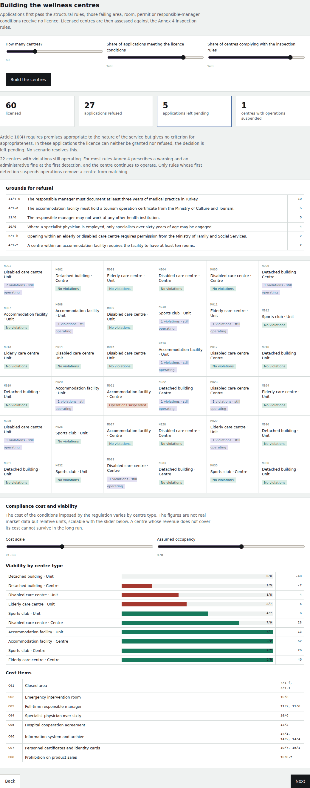

A compliance cost layer prices the obligations the regulation imposes — closed
area, emergency room, full-time responsible manager, hospital cooperation,
information system, and the revenue lost to the prohibition on product sales —
and shows which business models remain viable. Fixed obligations affect small
operators disproportionately.

### 03 · Visitors

Synthetic health tourists are drawn from the trained model and matched against
the centres one by one. A visitor may go unserved for one of four reasons. A
person in convalescence is ineligible under Article 10(8)(d), which is a
regulatory prohibition. Finding no centre that offers the service sought, and
finding those centres at capacity, both arise from supply not meeting demand and
have nothing to do with the regulation. **Only for those resident abroad does
Article 17 come into play, and only then is the outcome undefined.**

Selecting a scenario opens a detail panel: the status of Article 17, the year it
comes into force, the acceptance rate after the determination, the inspection
rate and whether units fall within scope. Below is **S0 — Uncertainty
persists**: no determination is ever made, and a purple **Undefined** band
appears in the result strip.

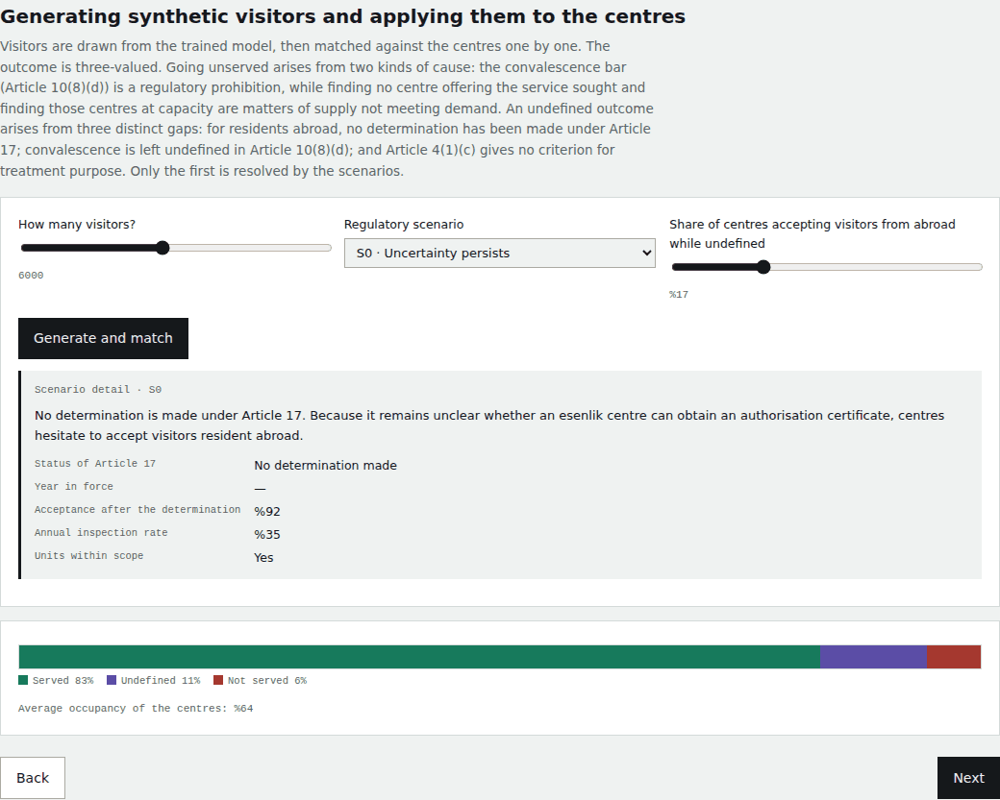

The same screen under **S1 — Permissive determination**. The determination is
made in 2028 and the purple band drops but does not vanish. The visitor count
and every other setting are identical across the two runs; the scenario is the
only thing that changes.

What remains is the study's most striking finding: **resolving Article 17 does
not remove uncertainty altogether**, because the undefined notion of
convalescence and the missing criterion for treatment purpose are resolved by no
scenario.

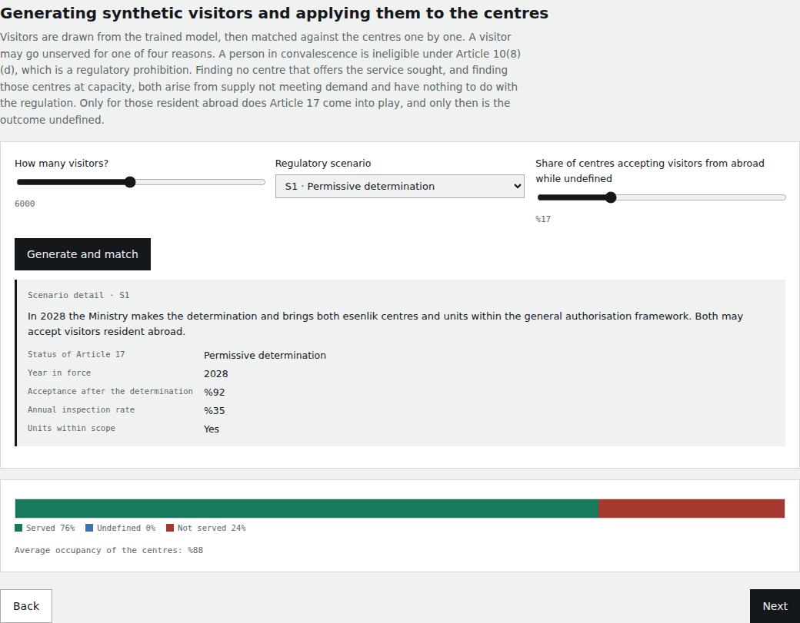

### 04 · Results

This step draws on three separate sources: the matching results and segment
breakdown come from the run just made, the sensitivity analysis is computed
separately on its own fixed baseline, and the multi-year projection was computed
in advance and is unaffected by any session setting.

The provision determining the outcome is recorded for every visitor. In the run
below, 79% were served, 12% found the centres offering their service at
capacity, and 9% were ineligible under Article 10(8)(d). Separating these
matters for policy: a capacity shortage, a narrow service mix and a legal bar
call for entirely different interventions. The breakdown by residence, age group
and service sought shows where the shortfall concentrates — thermal and
balneology demand is met noticeably less often than the rest, because that
archetype requires at least two of its core services in the same centre.

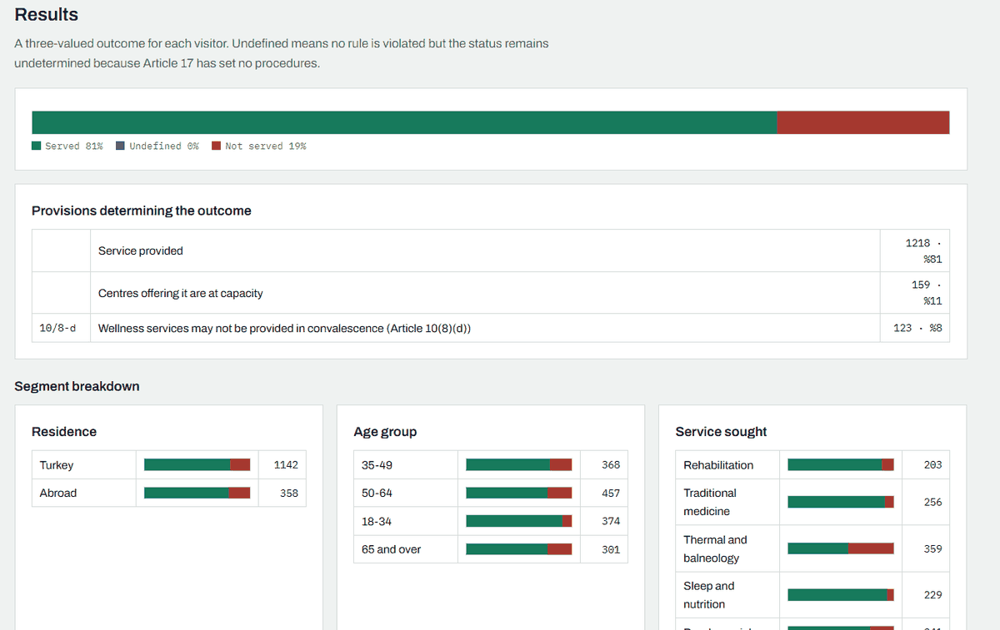

A sensitivity analysis moves each free parameter to its lower and upper bound
and measures the change in the outcome, and a ten-year projection tracks eight
indicators across the five scenarios, including unlicensed operation and the
actual inspection rate.

### 05 · Uncertainty

A catalogue of **fourteen entries across six types**, three bearing directly on
health tourism, produced by reading the regulation article by article. Each
entry marks a gap that prevents a provision from being applied on its own, and
the list can be filtered by type.

**Four of these fourteen entries are wired into the simulation.** The
determination under Article 17, the undefined notion of convalescence and the
missing criterion for treatment purpose produce an undefined outcome at the
matching stage; the missing criterion for appropriate premises (Article 10(4))
does so at the licensing stage. Only the uncertainty under Article 17 is
resolved by the scenarios; **the other three persist in every scenario.** The
remaining ten are identified but not modelled.

Article 17 is only the first line. It is followed by the mismatch between the
heading and the text of the same article, the open-ended service list of Article
4(1)(c), the undefined notion of convalescence in Article 10(8)(d) — a
prohibition with severe sanctions resting on a concept without criteria — and
the absence of any criterion for space appropriate to the service in Article
10(4).

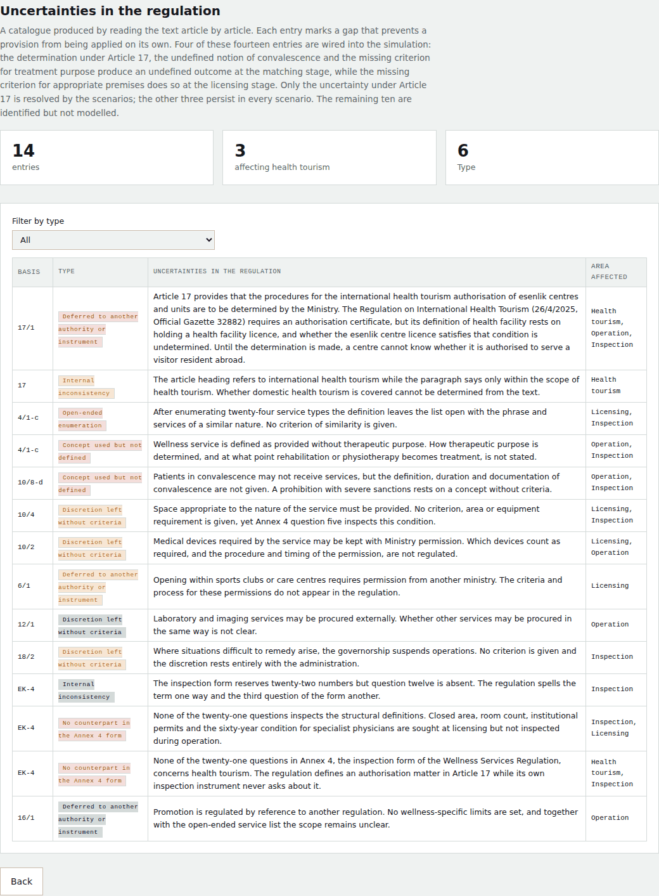

---

## Findings

The figures come from the tool's default settings and are not validated against
real data. What matters is not the absolute values but the differences between
scenarios and the ranking of sensitivities.

- **Fourteen uncertainty entries** were identified, three bearing directly on
  health tourism; the most frequent type is discretion without criteria.
- **No inspection question** addresses the structural definitions of the
  regulation.
- Where no determination is made, the share of visitors resident abroad
  obtaining service falls to **59%** by the tenth year and **12%** of demand
  remains undefined; where it is made in 2028, the share rises to **80%**, yet
  **6%** of demand still remains undefined, because the undefined notion of
  convalescence and the missing criterion for treatment purpose are resolved by
  no scenario.
- Compliance with licensing conditions **almost wholly determines licence
  refusal** yet barely affects access to services, which is governed by capacity.
- In the compliance cost layer, **fixed obligations affect small operators
  disproportionately**; units in detached buildings fall below the viability
  threshold.

## Method

**Visitor model.** The structure of the network is set by domain expertise. The
variables come from the individual planning criteria of Article 10(1) — age,
general health status, existing risk factors and lifestyle — extended with
convalescence under Article 10(8)(d) and residence under Article 17. The
probability tables are learned from the record set. A small uniform Dirichlet
prior is added to the counts, solely so that rows with no observations are not
left undefined; its influence vanishes as records accumulate.

**Rule engine.** Twenty-one inspection questions from Annex 4 and twelve
structural rules derived from the articles. The two sets act at different
moments: structural rules at licensing, Annex 4 rules during operation.

**Sanction ladder.** Annex 4 defines a distinct sanction for the first, second
and third detection of each rule. Centres are tracked individually with their
own detection counters; the ladder can only operate this way and loses its
meaning if reduced to an average.

**Regulatory impact layers.** Compliance costs, an unlicensed operation branch
for refused applications, limited inspection capacity, and a sensitivity
analysis over every parameter.

## Caveats

> **This is not a forecast.** There is no data to project a sector one month old
> across ten years. Entry rate, demand growth, compliance behaviour and cost
> figures are assumptions. Results are reported as the median and the 10–90
> percentile range across repetitions rather than as a single estimate.

> **The data is synthetic.** All centres and visitors are generated. No real
> person or institution data is used. `veri/ornek_kayitlar.json` is not real
> intake data but a starter set constructed from domain rules, expected to be
> replaced with real records.

> **The binding text is the Official Gazette.** The rule sets are transcriptions
> of the regulation and constitute neither legal interpretation nor advice.

## Development

```bash
python3 veri/uret_ornek.py   # regenerate the starter record set
python3 calistir.py          # run the five scenarios on the command line
python3 onhesap.py           # compute the projections
python3 paketle.py           # rebuild index.html
```

The core depends only on the standard library; no installation is needed.

## Related paper

> Köse, G. & Köse, U. (2026). Measuring Uncertainty: An Artificial Intelligence
> Assisted Regulatory Impact Analysis of the Wellness Services Regulation and
> Health Tourism. *INNOVAHEALTH 2026 — 3rd International Congress on Innovative
> Approaches in Health Sciences*, 2–5 September 2026, Kyrenia, TRNC.

## License

MIT — see [LICENSE](LICENSE).